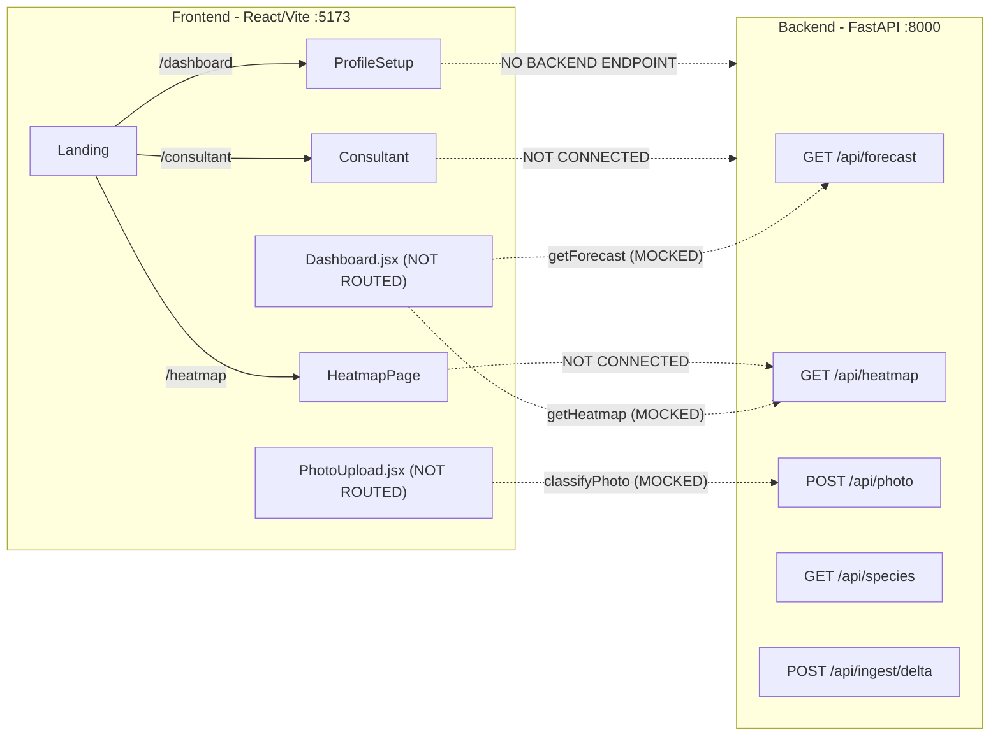
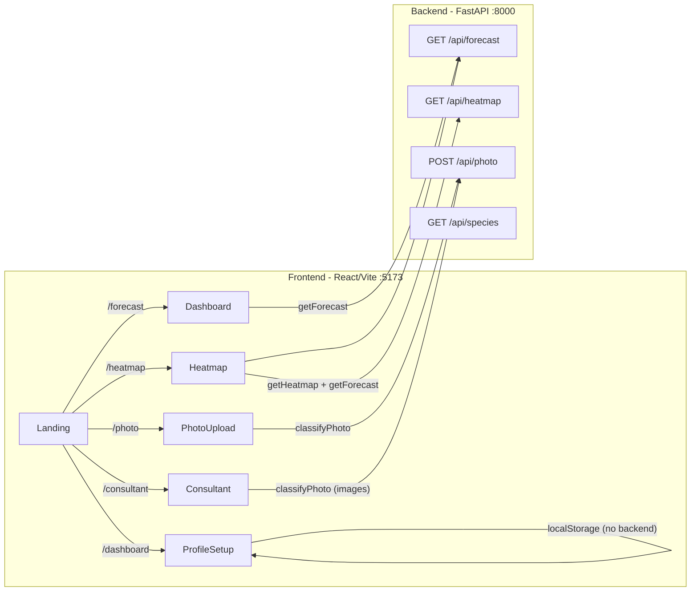

# Frontend-Backend Integration Plan

## Current State

The frontend (React + Vite) and backend (FastAPI) are developed independently. **No real API call runs today** — `MOCK = true` in `client.js` short-circuits everything. Several pages are hardcoded, disconnected from routing, or expect data shapes that don't match the backend.




## Blocking Issues (must fix first)

### B1. Resolve merge conflict in `config.py`

[backend/config.py](backend/config.py) has unresolved `<<<<<<< HEAD` / `=======` / `>>>>>>>` markers in `ALLERGEN_SPECIES` and `GOOGLE_TO_INAT_MAP`. The backend crashes on import. Pick one side's taxon IDs (the `HEAD` branch uses the IDs that match the graphify-out analysis). Remove all conflict markers.

### B2. Flip `MOCK = false` in `client.js`

[frontend/src/api/client.js](frontend/src/api/client.js) line 2: change `const MOCK = true` to `const MOCK = false`. Keep the mock functions and `MOCK` constant so they can be toggled back for offline dev, but the default must be `false` for integration.

## Routing Fixes

### R1. Wire `Dashboard.jsx` to a route

[frontend/src/App.jsx](frontend/src/App.jsx) imports `Dashboard` but never renders it. The `/dashboard` route currently shows `ProfileSetup`. Fix:

- Add route `/forecast` (or `/dashboard/forecast`) pointing to `Dashboard`
- Keep `/dashboard` pointing to `ProfileSetup` (profile setup flow)
- Add a nav link for the forecast view

### R2. Wire `PhotoUpload.jsx` to a route

[frontend/src/pages/PhotoUpload.jsx](frontend/src/pages/PhotoUpload.jsx) is unreachable. Add `/photo` route in `App.jsx` and a nav link (e.g. in Navbar or from Consultant page).

### R3. Update Navbar links

[frontend/src/components/Navbar.jsx](frontend/src/components/Navbar.jsx) currently has: Live Map (`/heatmap`), My Profile (`/dashboard`), AI Consultant (`/consultant`). Add: Forecast (`/forecast`), Identify Plant (`/photo`).

## Data Shape Fixes

### D1. Heatmap page: replace static Google Maps with backend GeoJSON

This is the biggest mismatch. The backend `/api/heatmap` returns a **GeoJSON FeatureCollection** with H3 hexagon polygons:

```json
{
  "type": "FeatureCollection",
  "features": [
    {
      "type": "Feature",
      "geometry": { "type": "Polygon", "coordinates": [[[lng, lat], ...]] },
      "properties": {
        "h3_cell": "...", "composite_index": 2.3,
        "severity": "moderate", "top_species_name": "White oak"
      }
    }
  ]
}
```

[frontend/src/pages/Heatmap.jsx](frontend/src/pages/Heatmap.jsx) currently:

- Uses `@react-google-maps/api` with `HeatmapLayer` (expects `google.maps.LatLng` objects)
- Generates 50 random points locally
- Sidebar has hardcoded values ("8.4", "Critical", etc.)
- Has a **hardcoded Google Maps API key** in source

Two options (choose one):

**Option A (recommended): Replace Heatmap.jsx with Leaflet + GeoJSON** — match `Dashboard.jsx`'s approach. Reuse the `colorFromCompositeIndex` function and `<GeoJSON>` rendering from Dashboard. Wire sidebar to real data from the forecast API. This eliminates the Google Maps dependency for this page.

**Option B: Convert GeoJSON to Google Maps format** — extract centroids from each GeoJSON feature and convert to `google.maps.LatLng` weighted points. More work, loses the hex polygon visualization.

### D2. Dashboard.jsx mock heatmap shape mismatch

When `MOCK=true`, `buildMockHeatmap` returns `{ points: [...] }` but `Dashboard.jsx` passes it to Leaflet's `<GeoJSON>` which expects a FeatureCollection. This crashes silently. With `MOCK=false` the backend returns proper GeoJSON, so this is already correct for live mode. Keep the mock for offline dev but fix its shape to return a GeoJSON FeatureCollection (or just accept that mocks won't render the map layer).

### D3. Heatmap sidebar: bind to real forecast data

Call `getForecast(lat, lng)` when the heatmap loads. Populate the sidebar sections:

- **Current Pollen Index**: `daily[0].composite_index` and `daily[0].severity`
- **Pollen type breakdown**: derive from `daily[0].top_species` grouped by `pollen_type`
- **14-Day Timeline**: use `daily` array's `composite_index` values
- **AI Advisory**: use `narrative.headline` + `narrative.today_summary`

## Page-by-Page Wiring

### P1. Heatmap page (`/heatmap`)

Files: [Heatmap.jsx](frontend/src/pages/Heatmap.jsx), [client.js](frontend/src/api/client.js)

- Import and call `getHeatmap(lat, lng)` and `getForecast(lat, lng)` from `client.js`
- Replace hardcoded data with API responses
- Move Google Maps API key to `import.meta.env.VITE_GOOGLE_MAPS_API_KEY` (or switch to Leaflet per D1)
- Add loading spinner and error state (follow Dashboard.jsx pattern)
- Bind sidebar pollen index, timeline bars, and AI advisory text to forecast response

### P2. Dashboard/Forecast page (`/forecast`)

Files: [Dashboard.jsx](frontend/src/pages/Dashboard.jsx)

- Already calls `getForecast` and `getHeatmap` from `client.js` — works with `MOCK=false`
- Add user geolocation: replace hardcoded `SD_CENTER` with `navigator.geolocation` (fall back to SD)
- The search bar is non-functional — wire it to geocode a city/pincode and re-fetch forecast

### P3. Photo Identify page (`/photo`)

Files: [PhotoUpload.jsx](frontend/src/pages/PhotoUpload.jsx)

- Already calls `classifyPhoto` from `client.js` — works with `MOCK=false`
- Uses `PollenIndex` and `AdvisoryPanel` components correctly for `local_forecast`
- No changes needed beyond routing (R2)

### P4. Profile Setup page (`/dashboard`)

Files: [ProfileSetup.jsx](frontend/src/pages/ProfileSetup.jsx)

- **Backend has no profile endpoint.** The form collects data (name, email, triggers, symptoms, medications, alerts) but has no API to submit to.
- Several form inputs are uncontrolled — `fullName`, `email`, `location` have `placeholder` but are not bound to `form` state via `value` and `onChange`.
- Fix: bind all inputs to `form` state, store profile in `localStorage` for now (no backend endpoint exists), and pass the trigger data to the forecast page so it can personalize the view.
- The "Initialize Radar & Save Profile" button navigates to `/heatmap` — update to navigate to `/forecast` (the real dashboard).

### P5. AI Consultant page (`/consultant`)

Files: [Consultant.jsx](frontend/src/pages/Consultant.jsx)

- Currently 100% mocked with `setTimeout` replies
- Two integration paths:
  - **Text queries**: Wire to a new `POST /api/consultant` backend endpoint that wraps Gemini with the user's forecast context (does not exist yet — would need backend work)
  - **Image upload**: Wire to existing `classifyPhoto` from `client.js` — replace the mock Oak response with a real API call
- Minimal integration: at least wire image uploads to `/api/photo` so plant identification works through the chat

## Environment and Dev Setup

### E1. Backend env vars

Ensure [.env](/.env) has all required keys. Backend needs:

- `GOOGLE_POLLEN_API_KEY`
- `GEMINI_API_KEY`  
- `GEMINI_MODEL` (defaults to `gemini-2.5-flash`)
- `GCP_PROJECT_ID`
- `INAT_APP_ID` (optional)
- `USE_FIRESTORE=false` (for local dev)

### E2. Frontend env vars

Create `frontend/.env` with:

- `VITE_GOOGLE_MAPS_API_KEY` — move the hardcoded key from Heatmap.jsx

### E3. Dev startup

- Backend: `cd backend && uvicorn main:app --reload --port 8000`
- Frontend: `cd frontend && npm run dev` (Vite dev server on :5173, proxies `/api` to `:8000`)
- Or: `docker-compose up` (backend only at port 8000, then run frontend separately)

### E4. Add frontend service to docker-compose

Optionally add a frontend service to [docker-compose.yml](docker-compose.yml) for one-command startup.

## Post-Integration Target




